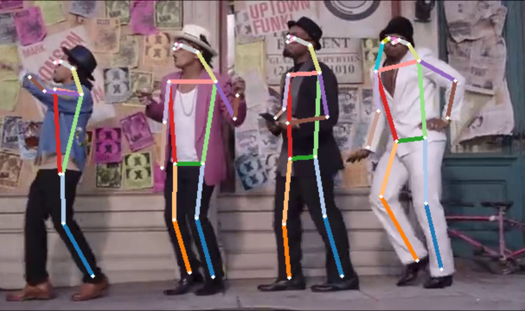

# UltimateLabeling

[](https://travis-ci.com/alexandre01/UltimateLabeling)
[](https://opensource.org/licenses/MIT)
[](https://pypi.python.org/pypi/ultimatelabeling)
[](https://pypi.python.org/pypi/ultimatelabeling) 

A multi-purpose Video Labeling GUI in Python with integrated SOTA detector and tracker. Developed using PyQt5.

**[Disclaimer: This repository is sill under development]**

The integrated object detectors and trackers are based on the following codes:
- [OpenPifPaf](https://github.com/vita-epfl/openpifpaf): for human pose estimation
- [YOLO darknet](https://github.com/AlexeyAB/darknet): for object detection
- [SiamMask](https://github.com/foolwood/SiamMask): for visual object tracking
- [Hungarian algorithm (scipy.optimize)](https://github.com/scipy/scipy): for optimal instance ID assignment

For remote server processing, follow the guide below in order to configure the [server files](https://github.com/alexandre01/UltimateLabeling_server).

## TODO list
- [x] Load/write tracking info in seperate files for better performance on large videos
- [x] Fix lag problems of the player
- [x] Complete the Hungarian assignment algorithm
- [x] Add import/export feature
- [ ] Add super-resolution feature
- [ ] Change default COCO class names


## Demo 





## Features
- SSH connection to the remote server (see below to configure the server)
- YOLO and OpenPifPaf integrated object & pose detectors (single frame and entire video mode)
- Hungarian instance ID assignment
- SiamMask Visual object tracking for missing or mislabeled objects
- Zoom on the video, resizable bounding boxes and skeletons
- Dark mode!


## Installation

Start by cloning the repository on your computer:
```bash
git clone https://github.com/alexandre01/UltimateLabeling.git
cd UltimateLabeling
```

We recommend installing the required packages in a virtual environment to avoid any library versions conflicts. The following will do this for you:
```bash
virtualenv --no-site-packages venv
source venv/bin/activate
pip install -r requirements.txt
```

Otherwise, just install the requirements on your main Python environment using `pip` as follows:
```bash
pip install -r requirements
```

Finally, open the GUI using: 
```bash
python -m ultimatelabeling.main
```

## Input / output

To start labeling your videos, put these (folder of images or video file, the frames will be extracted automatically) inside the `data` folder. 

- Import labels: To import existing .CSV labels, hit `Cmd+I` (or `Ctrl+I`). UltimateLabeling expects to read one .CSV file per frame, in the format: "class_id", "xc", "yc", "w", "h".

- Export labels: The annotations are internally saved in the `output` folder. To export them in a unique .CSV file, hit `Cmd+E` (or `Ctrl+E`) and choose the destination location.

If you need other file formats for your projects, please write a GitHub issue or submit a Pull request.

## Remote server configuration
To configure the remote GPU server (using the code in [server files](https://github.com/alexandre01/UltimateLabeling_server).), follow the steps below:

```bash
git clone https://github.com/alexandre01/UltimateLabeling_server.git
cd UltimateLabeling_server
pip install -r requirements.txt
bash siamMask/setup.sh
bash detection/setup.sh
```

The data images and videos should be placed in the folder `data`, similarly to the client code.

To extract video files, use the following script:

```bash
bash extract.sh data/video_file.mp4
```


## Licence
Copyright (c) 2019 Alexandre Carlier, released under the MIT licence.
